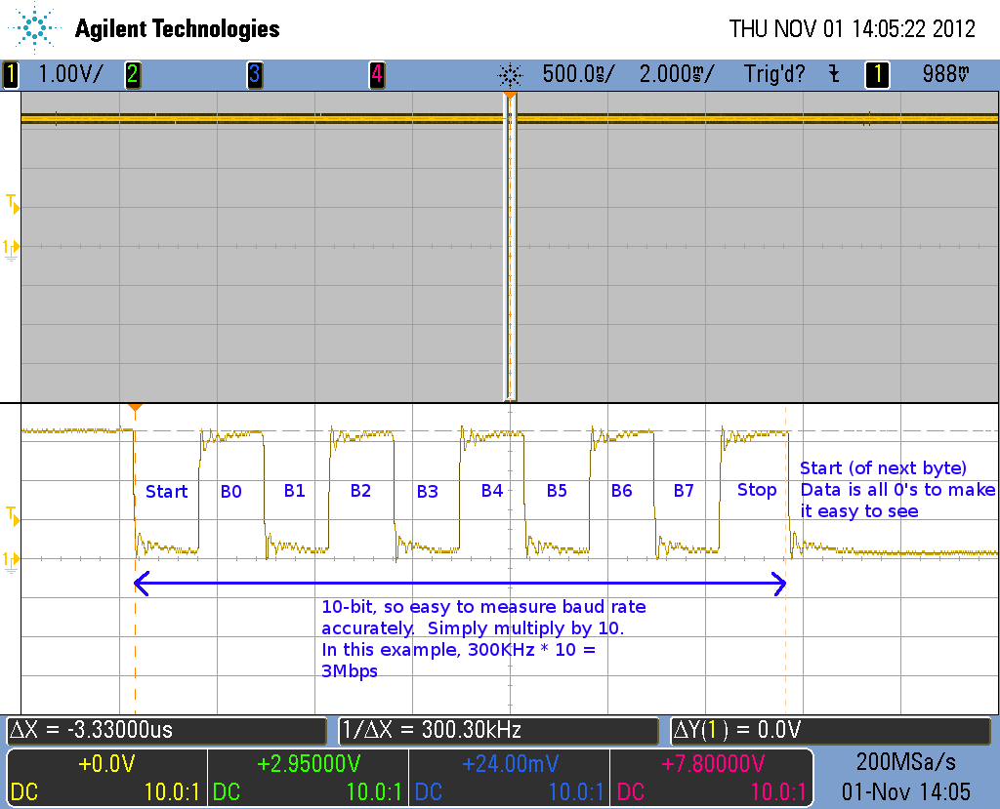

# linux-serial-test

Test a serial port using a loopback adapter or by connecting two
serial ports together. 

# Linux Serial Test Application

This is a fork of cbrake's original linux-serial-test. It has various
changes by hackerb9 which may or may not be improvements.

1. Accepts that Tx count will be incorrect due to buffering and does
   not report an error if it differs from Rx. 
1. Does report an error if the serial hardware (or kernel module) is
   unable to set the requested baudrate.
1. Attempts to workaround Linux's `closing_wait` delay of 30 seconds
   after exiting the program which occurs when the kernel's transmit
   buffer is very large compared to the receive baudrate. (See
   setserial(8)). The workaround requires root access, which is
   typically not needed for this program, so the workaround is skipped
   if the kernel's transmit buffer is estimated to be drained quickly.
1. Measures an estimate of the received baudrate and, optionally,
   reports an error if it is significantly different than requested.
1. EAGAIN exits process_read_data() since it likely means there is no
   more data available. This avoids the situation where linux-serial-test 
   would hang and have to be killed with ^C three times.
1. Allow non-standard baudrates to be specified directly instead of
   requiring a clock divisor. E.g., `-b 512000`.
1. Allow baudrates to be specified in "exponential notation" (see
   strtod(3)). For example, `-b 3e6` would be equivalent to `-b 3000000`.
1. The results of the test are printed clearly when the program exits.

# Compiling

This is a very simple program -- there are several ways to compile it on Linux:

## directly using GCC

`gcc -o linux-serial-test linux-serial-test.c bother.c`

## Using Make

- `make`

# Usage

```
Usage: linux-serial-test [OPTION]

  -h, --help
  -b, --baud               Baud rate, 115200, etc (115200 is default)
  -p, --port               Port (/dev/ttyS0, etc) (must be specified)
  -d, --divisor            UART Baud rate divisor (old way to set custom baud rates)
  -R, --rx_dump            Dump Rx data (ascii, raw)
  -T, --detailed_tx        Detailed Tx data
  -s, --stats              Dump serial port stats every 5s
  -S, --stop-on-err        Stop program if we encounter an error
  -y, --single-byte        Send specified byte to the serial port
  -z, --second-byte        Send another specified byte to the serial port
  -c, --rts-cts            Enable RTS/CTS flow control
  -B, --2-stop-bit         Use two stop bits per character
  -P, --parity             Use parity bit (odd, even, mark, space)
  -k, --loopback           Use internal hardware loop back
  -K, --write-follow       Write follows the read count (can be used for multi-serial loopback)
  -e, --dump-err           Display errors
  -r, --no-rx              Don't receive data (can be used to test flow control)
                           when serial driver buffer is full
  -t, --no-tx              Don't transmit data
  -l, --rx-delay           Delay between reading data (ms) (can be used to test flow control)
  -a, --tx-delay           Delay between writing data (ms)
  -w, --tx-bytes           Number of bytes for each write (default is to repeatedly write 1024 bytes
                           until no more are accepted)
  -q, --rs485              Enable RS485 direction control on port, and set delay from when TX is
                           finished and RS485 driver enable is de-asserted. Delay is specified in
                           bit times. To optionally specify a delay from when the driver is enabled
                           to start of TX use 'after_delay.before_delay' (-q 1.1)
  -Q, --rs485_rts          Deassert RTS on send, assert after send. Omitting -Q inverts this logic.
  -o, --tx-time            Number of seconds to transmit for (defaults to 0, meaning no limit)
  -i, --rx-time            Number of seconds to receive for (defaults to 0, meaning no limit)
  -A, --ascii              Output bytes range from 32 to 126 (default is 0 to 255)
  -I, --rx-timeout         Receive timeout
  -O, --tx-timeout         Transmission timeout
  -W, --tx-wait            Number of seconds to wait before to transmit (defaults to 0, meaning no wait)
  -Z, --error-on-timeout   Treat timeouts as errors
  -n, --no-icount          Do not request driver for counts of input serial line interrupts (TIOCGICOUNT)
  -f, --flush-buffers      Flush RX and TX buffers before st, arting
```


# Examples

## Stress test a connection

    linux-serial-test -s -e -p /dev/ttyUSB0 -b 3000000

This will send full bandwidth data with a counting pattern on the TX
signal. On any data received on RX, the program will look for the
counting pattern and report any missing data. This test should be done
using a loopback cable. Hit ^C when done.

## Test RTS/CTS flow control

    linux-serial-test -s -e -p /dev/ttyUSB0 -c -l 250

This enables RTS/CTS flow control and sends a counting pattern on the TX signal.
Reads are delayed by 250ms between reads, which will cause the buffer to fill up
and start using flow control. As before any missing data in the pattern is
reported, and if flow control is working correctly there should be none.

This test can be done using a loopback cable, or by running the program on both
ends of the connection. For a two-port solution invoke the following command on
the receiver side:

    linux-serial-test -s -e -p /dev/ttyUSB1 -t -c -l 250

and on the transmitter side:

    linux-serial-test -s -e -p /dev/ttyUSB0 -r -c

## Stress test that can be used in a script

    linux-serial-test -s -e -p /dev/ttyUSB0 -b 115200 -o 5 -i 7

This transmits for five seconds and receives for seven seconds, after
which it will exit. The exit code will be zero if the received pattern
was correct, so this can be used as part of an automated test script.

See the [testallspeeds.sh](testallspeeds.sh) for an example wrapper
script which will try the standard baudrates for 2 seconds each and
report a summary. (The user will be asked for which serial port to use
if there is more than one available.)

Note that the time the program takes to run can be significantly
longer than the -i or -o limits. See the note below about Linux's
closing_wait.

## Output a pattern where you can easily verify baud rate with scope:

    linux-serial-test -y 0x55 -z 0x0 -p /dev/ttyUSB0 -b 3000000

This outputs 10 bits that are easy to measure, and then multiply by 10
in your head to get baud rate.



# Bugs, Gremlins, and other Mischiefmakers

* The Linux kernel buffers serial transmissions and, at low baud
  rates, can end up causing a process to wait up to 30 seconds after
  the program has ended. Only by running this program as root can that
  buffer be flushed instead of drained.

* The `-r` and `-t` options are confusingly named as they mean
  _inhibit_ receive and transmit, respectively.
  
  (There are a *lot* of flags. Perhaps a different command-line
  interface is warranted.)
  
* The --write-follow option reverses the way the program works and may
  not be necessary.
  
* The `-R` and `-T` options do not actually dump the data, which is a
  bit confusing. They seem to merely increase verbosity.
  
* Flushing the Rx/Tx buffers at startup ought to be the default even
  without --flush-buffers.
  
* Baudrate estimation has proven useful, but there is at least one
  case in which the bits-per-second appears lower because the hardware
  is silently adding a second stopbit.

* There should be illustrations for the loopback and dual-serial ports
  configurations.
  
* Dual-serial ports should be able to be handled by a single process
  instead of two. 

* This program has not been tested above 3 Mbaud.

* RTS/CTS (hardware flow control) breaks down on some UARTs at
  extremely high speeds. For example, FTDI's application note for the
  FT232H says it can be set to 12 Mbaud, but then CTS/RTS may lose
  data.

* There is no test, yet, for software flow control (XON/XOFF). In
  particular, better serial ports have "hardware supported XON/XOFF"
  which will work even on UARTs with large FIFOs. It may even work at
  12 Mbaud because it skips having to send the signal to the other
  side to request transmission to cease.
  
* There should be options to print out just a single statistic for
  better shell scriptability.
